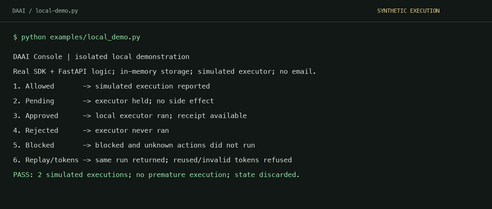
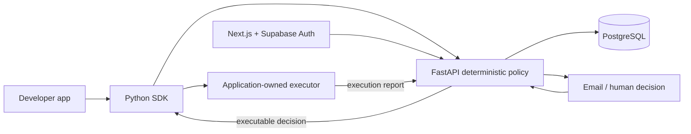

# DAAI Console

A cooperative governance layer for registered Python agent actions.

**Portfolio release. The original hosted beta is discontinued.** This repository
is an MIT-licensed source snapshot by Sany Alam, available for inspection and
reuse. [Project showcase](https://daaihq.com) |
[Engineering case study](docs/case-study.md) | [Safe local demo](docs/local-setup.md)

An agent application proposes a registered action. DAAI evaluates deterministic
policy, pauses for human approval when necessary, and records a receipt. The
application owns the real executor, external credentials, and side effects.
`intercept()` never executes callbacks. DAAI cannot intercept arbitrary code or
prevent a developer from bypassing the cooperative gate.

## Try the workflow

Python 3.11 is the verified runtime. No cloud account or email provider is needed:

```bash
git clone https://github.com/sanyAlam/daai.git
cd daai
python3.11 -m venv .venv
source .venv/bin/activate
python -m pip install -e "apps/api[dev]" -e "packages/daai-python[dev]"
python examples/local_demo.py
```

The demo calls the actual FastAPI routes and SDK through an in-process HTTP test
transport. Only persistence and email delivery are substituted: it uses the
existing in-memory test repository and captures approval links locally. The
executor returns synthetic data. It sends no email and performs no external
business action. This is a reproducible demonstration, not a deployed service or
proof of PostgreSQL concurrency behavior.



## Implemented capabilities

- Four deterministic policies: always allow, always require approval, amount
  threshold approval, and always block. Unknown actions are blocked.
- Separate governance and execution states, workspace-scoped credentials,
  hashed keys and decision tokens, token expiry and one-time decisions.
- Idempotency with payload conflict detection, execution reports, and receipts.
- Python client, in-memory/SQLite pending stores, and application-owned runner.
- FastAPI/PostgreSQL backend and Supabase-authenticated Next.js dashboard.
- Optional setup-time policy suggestions; runtime decisions never call an LLM.



## Development

```bash
python -m pytest apps/api/tests -q
python -m pytest packages/daai-python/tests -q
cd apps/dashboard
npm ci
npm run lint
npm run build
```

[Local setup](docs/local-setup.md) explains the isolated demo and the constraints
for running the full database/dashboard stack. The demo is the verified quick
start; a fresh full Supabase deployment has not been verified for this release.

## Limitations and maintenance

This is an archived engineering portfolio project, not a supported SaaS offering.
There is no uptime or support commitment. Self-hosting requires your own isolated
database/auth configuration, unique peppers, and a review of production settings.
The local demo does not validate external auth, live email delivery, database
locks, or production operations. Exactly-once external execution remains the
application's responsibility. There is no OS-level sandbox, SDK retry/backoff,
enterprise RBAC, or webhook continuation.

The [companion SDK](https://github.com/sanyAlam/daai-console-python) uses the
`daai_console` import. The original embedded SDK here uses `daai`; they are
separate packages. Both repositories use MIT for the new source release.
Previously published PyPI alpha artifacts retain their original license; they
have not been republished.

See [CONTRIBUTING](CONTRIBUTING.md), [SECURITY](SECURITY.md), and
[release provenance](docs/release-provenance.md).
